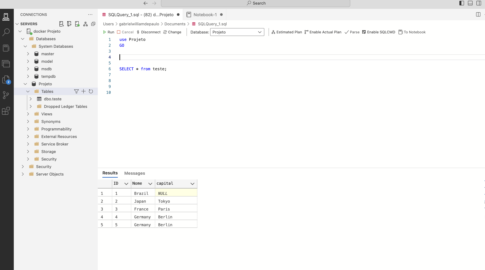
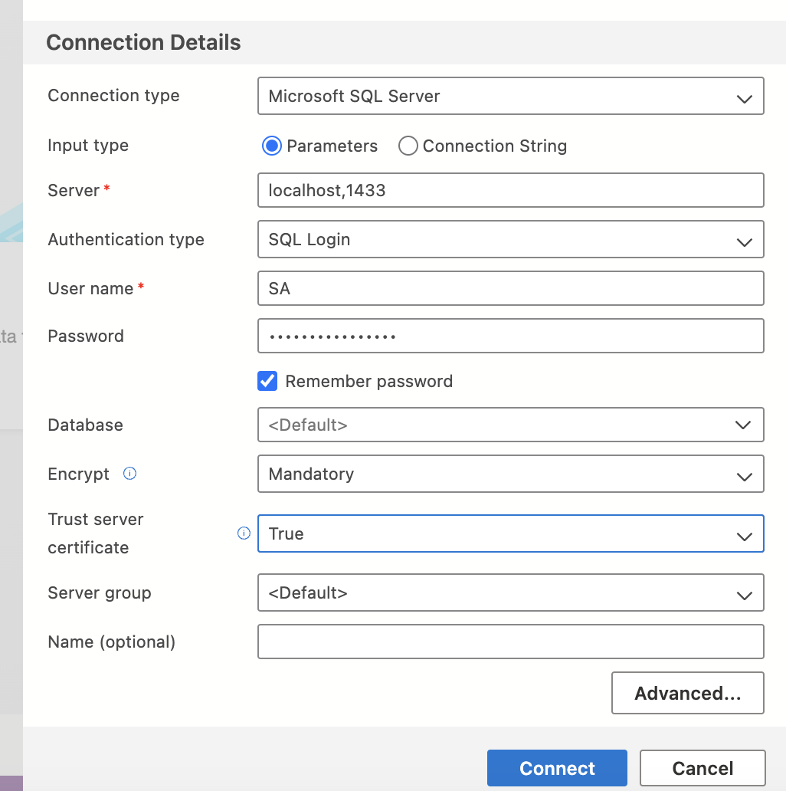

<h1>Nome do Projeto: ConsumoAPIS</h1>

Parte do Código em C# mostrando o consumo da API.

 O **Azure Data Studio** com demonstração dos dados inseridos na tabela.

## Conectando o Azure Data Studio ao SQL Server no Docker

1. Abra o **Azure Data Studio**.
2. Clique em **New Connection**.
3. No campo **Server**, digite `localhost` (ou `localhost,1433` se configurou uma porta específica).
4. Em **Authentication Type**, escolha **SQL Login**.
5. No campo **Login**, insira `SA`. No campo **Password**, coloque a senha definida para o SQL Server.
6. Clique em **Connect**.
   
Agora você está conectado ao SQL Server no Docker.

<h2>Descrição</h2>

 Este projeto documenta meu aprendizado em C# com foco no consumo de APIs. Neste projeto estou utilizando a REST Countries API, um serviço público que fornece dados detalhados sobre países, como população, idiomas e bandeiras. Aqui, você encontrará um passo a passo do desenvolvimento, com exemplos de integração de APIs em C#.

<h2>Funcionalidades</h2>
<ul>
    <ul>
    <li><strong>Consumo de Dados de Países:</strong> Consome dados da REST Countries API para obter informações detalhadas sobre países, como nome, população, capital e região </li>
    <li><strong>Persistência no Banco de Dados:</strong> Grava e armazena os dados recebidos em um banco SQL Server, permitindo fácil recuperação e consulta.</li>
    <li><strong>Implementação com Docker:</strong> Utiliza um contêiner Docker para rodar o SQL Server no Mac, criando um ambiente isolado e estável para o banco de dados.</li>
    <li><strong>Organização e Estrutura de Código:</strong> Projeto modular e organizado, facilitando o entendimento e a manutenção do código C#.</li>
    <li><strong>Tratamento de Erros:</strong> Realiza o tratamento de erros e exceções, garantindo que erros de rede ou dados ausentes não quebrem a aplicação.</li>
    <li><strong>Recuperação de Dados em Tempo Real:</strong> Consulta dados do banco e exibe informações em tempo real, garantindo atualizações precisas sobre os países.</li>
</ul>

</ul>

<h2>Tecnologias Utilizadas</h2>

 <ul>
    <li><strong>C#</strong>: Linguagem principal usada para desenvolvimento da API.</li>
    <li><strong>.NET CLI</strong>: Framework usado para criar a aplicação multiplataforma em um ambiente compatível com macOS.</li>
    <li><strong>Entity Framework</strong>: Ferramenta ORM (Object-Relational Mapping) usada para facilitar a interação com o banco de dados.</li>
    <li><strong>SQL Server</strong>: Banco de dados onde os dados consumidos da API são armazenados, rodando em contêiner Docker.</li>
    <li><strong>Docker</strong>: Usado para configurar e rodar o SQL Server em um ambiente isolado e estável no macOS.</li>
    <li><strong>Azure Data Studio</strong>: Ferramenta usada para gerenciar e consultar o banco SQL Server.</li>

</ul>

<h2>Começando</h2>

<h3>Pré-requisitos</h3>

Antes de começar, você precisa ter instalado em sua máquina:

<ul>
    <li><a href="https://dotnet.microsoft.com/download">.NET SDK</a> (versão 5.0 ou superior)</li>
    <li>Um banco de dados SQL Server (local ou na nuvem)</li>
</ul>

<h3>Instalação</h3>
<ol>
    <li>Clone o repositório:
        <pre>git clone https://github.com/Gabrieldepaulo20/ConsumoAPIS.git</pre>
    </li>
    <li>Navegue até o diretório do projeto:
        <pre>cd ConsumoAPIS</pre>
    </li>
    <li>Restaure as dependências:
        <pre>dotnet restore</pre>
    </li>
    <li>Execute o projeto:
        <pre>dotnet run</pre>
    </li>
</ol>

<h3>Testando o Consumo de Dados</h3>

Por enquanto esta aplicação realiza apenas operações de <strong>GET</strong> para consumir dados da API REST Countries e armazená-los no banco de dados, você pode acompanhar a execução e verificar o armazenamento dos dados no <strong>SQL Server</strong> rodando no <strong>Docker</strong>.

Para testar o consumo e a gravação dos dados, você pode:

<ul>
    <li>Usar o <strong>Postman</strong> ou o <strong>curl</strong> para simular chamadas GET diretamente à <code>https://restcountries.com/v3.1/name/{pais}</code> (a URL da API REST Countries).</li>
    <li>Verificar no banco de dados SQL Server, usando o <strong>Azure Data Studio</strong> ou <strong> 
SQL Server Management Studio </strong> ou outra ferramenta, se os dados consumidos estão corretamente armazenados.</li>
</ul>

<h2>Contribuição</h2>

Contribuições são bem-vindas! Sinta-se à vontade para contribuir para este projeto de aprendizado.

<ol>
    <li>Faça um fork do repositório.</li>
    <li>Crie uma nova branch (<code>git checkout -b feature/nome-da-feature</code>).</li>
    <li>Faça suas alterações e commit (<code>git commit -m 'Adicionando uma nova feature'</code>).</li>
    <li>Envie para o repositório remoto (<code>git push origin feature/nome-da-feature</code>).</li>
    <li>Crie uma nova Pull Request.</li>
</ol>

<h2>Licença</h2>

A API REST Countries é distribuída sob a licença MIT.

<h2>Contato</h2>

Gabriel William de Paulo 
Email: <a href="mailto:gabrielwilliam208@gmail.com">gabrielwilliamdepaulo@gmail.com</a> 
GitHub: <a href="https://github.com/Gabrieldepaulo20">Gabrieldepaulo20</a>

</body>
</html>
